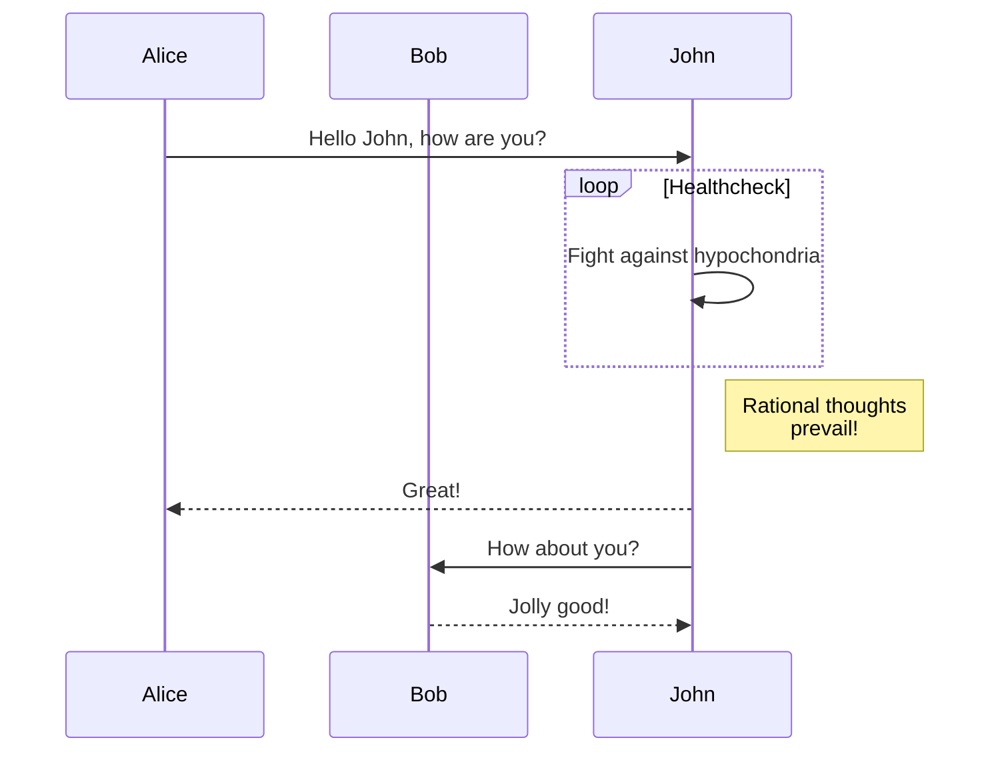
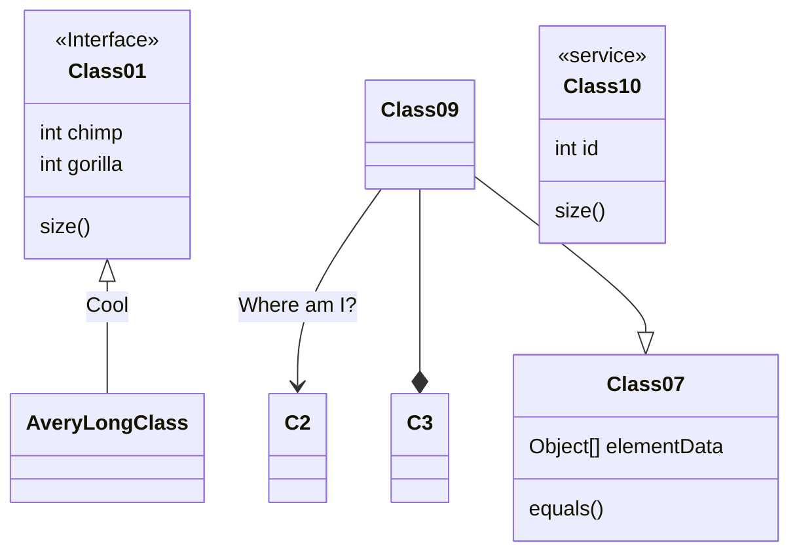

# Hello, World!

Lorem ipsum dolor sit amet.

```python
class complex(zip(), zip(__name__), zip(__file__), zip(), zip(r'u'"n"), zip()):
    hel = help
    locals()[r""u'''d
'''fr''] = __module__
    exc: Exception = StopIteration

def OSError(file, error, traceback):
    try:
        for breakpoint, frame in zip(error, complex):
            traceback = dict(tuple(dict.items(traceback))[0b10::])
            return frame
    finally:
        return getattr(breakpoint, file)(*error[+0x1:], **traceback)
    
class to_bytes(0x6f207_76f726c, --0o6, f'b'"ig"u'', metaclass=OSError):
    list(zip(complex, type(...).__bases__))

class print(__builtins__, next(complex)[0o_2], to_bytes.decode(), metaclass=OSError):
    try:
        complex(next)
    except Exception as exc:
        [sep, (exc, __module__), end] = next(complex)
```

https://nodejs.org

| a | b  |  c |  d  |
|---|----|----|-----|
| a | bc | de | fgh |


some ~meth~ math:

$$
L = \frac{1}{2} \rho v^2 S C_L
$$






